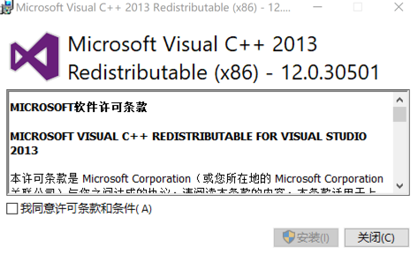
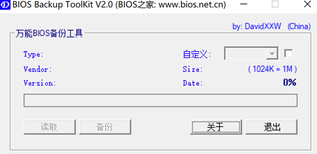
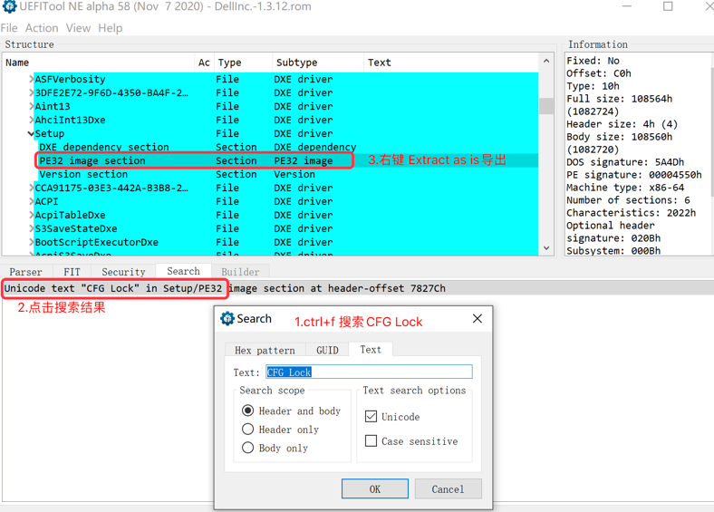
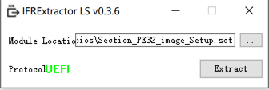
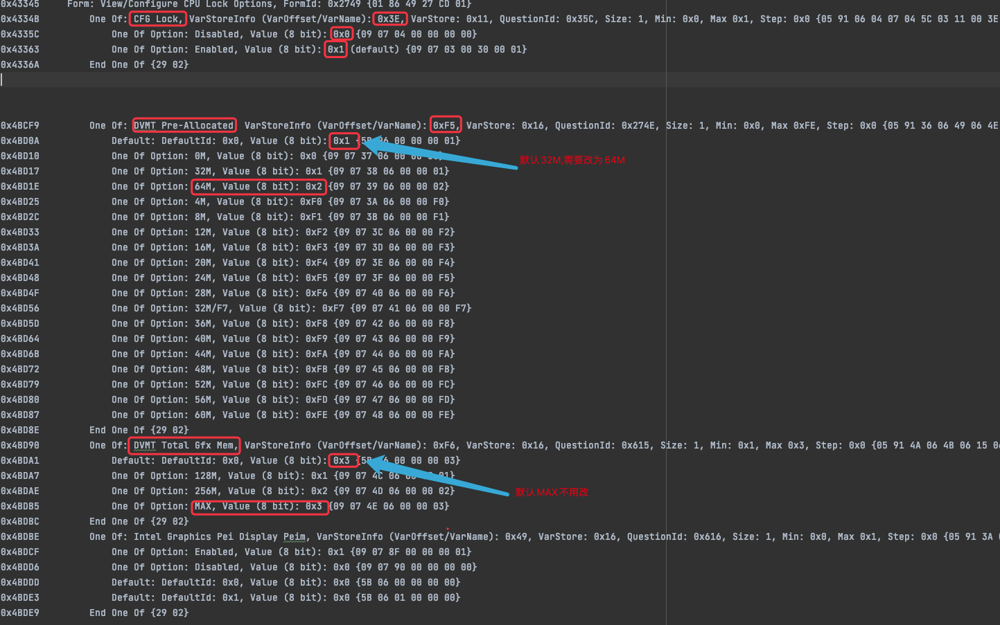
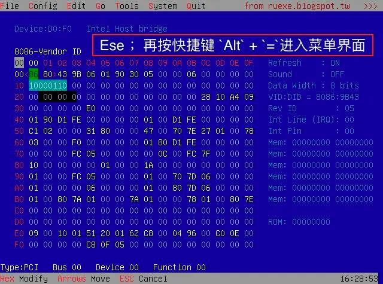
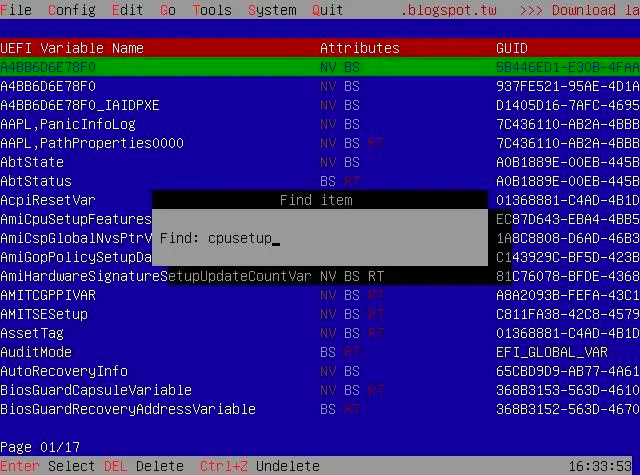
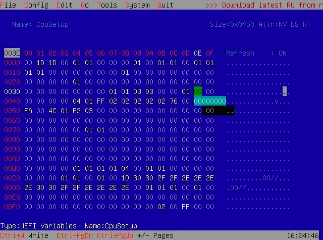
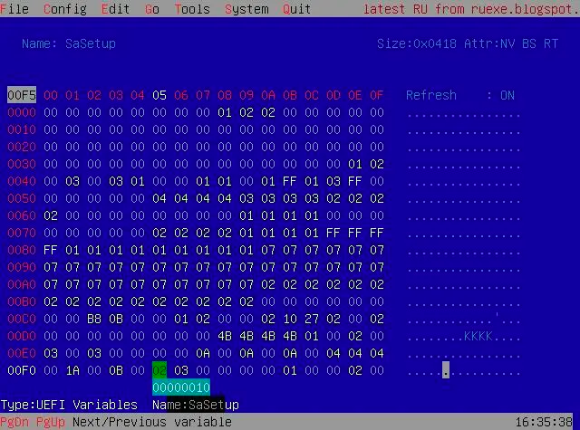
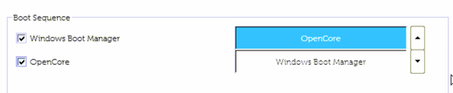

# OpenCore on Dell OptiPlex 7080 MFF

## 版本
Bigsur,11.5,20g71  

## 硬件配置
-   机箱: Dell Optiplex 7080mff 35W Pcie
-   电源: 180W
-   CPU: Intel Comet Lake i5-10500T
-   Chipset: Intel Q470
-   iGPU: UHD 630
-   dGPU: AMD RX560
-   Memory: 8G DDR4 2666 * 2
-   SSD1: 970 EVO PLUS PCI-E M.2 256GB (win10)
-   SSD2: 970 PRO PCI-E M.2 512GB (mac)
-   Sound: ALC256/ALC3246
-   Ethernet: Intel I219-LM7
-   WIFI-M2: [BCM94360CS2 M.2](https://dortania.github.io/Wireless-Buyers-Guide/types-of-wireless-card/m2.html) -> [Windows驱动](./tools/Broadcom_BCM94360CS_Driver_Win_78_10.zip)

## 完善度
|功能|状态|
|----|---|
|HWP                | ok |
|Sleep              | ok |
|iGPU with HiDPI    | ok |
|Ethernet           | ok |
|WiFi               | ok |
|Bluetooth          | ok |
|Sound              | ok |
|DP Audio           | ok |

- ### 1.设置 BIOS

|Settings|Value|
|----|---|
|System Configuration → Integrated NIC | Enabled |
|System Configuration → SATA Operation | AHCI |
|Security → PTT Security/PTT On | Disabled |
|Secure Boot → Secure Boot Enable | Disabled |
|Secure Boot → Secure Boot Mode | Audit Mode |
|Intel SGE → SGX | Disabled |
|Performance → Intel SpeedStep | Enabled |
|Performance → C-States Control | Enabled |
|Performance → Turboost | Enabled |
|Performance → HyperThread Control | Enabled |
|Power Management → Intel Speed Shift Technology | Enabled |
|Power Management → Deep Sleep Control | Disabled |
|Power Management → USB Wake Support | Disabled |
|Power Management → Wake on LAN/WLAN | Lan only |
|Power Management → Block Sleep | Disabled |
|POST Behavior → Fastboot | Minimal |
|Virtualization Support → Virtualization | Enabled |
|Virtualization Support → VT For Direct I/O | Disabled |
|Advanced configurations → ASPM | Auto |

- ### 2.查找bios隐藏选项【可选步骤】
    - 参考1:  [不刷BIOS修改AMI BIOS的方法（以CFG Lock为例）](https://www.zdynb.cn/2020/jie-suo-cfg-lock.html)
    - 参考2:  [解锁CfgLock](https://www.zdynb.cn/2020/jie-suo-cfg-lock.html)
    - windows下步骤
        1. 安装支持库[vs2013](https://www.microsoft.com/zh-CN/download/details.aspx?id=40784)  
           
        2. Bios提取工具 [BIOS Backup ToolKit](tools/bios/BIOS%20Backup%20ToolKit.zip)  
             
           或者使用 [FPTW](./tools/fptw64.exe) (使用命令: FPTW64.exe -D 备份文件名.rom -bios)  
           得到 [DellInc.-1.3.12.rom](./tools/bios/DellInc.-1.3.12.rom)  
        3. 查找BIOS中相关变量并提取二进制,工具: [UEFITool](https://github.com/LongSoft/UEFITool/releases)  
           
        4. 解释UEFI Tool二进制成文本,工具: [Universal-IFR-Extractor](https://github.com/LongSoft/Universal-IFR-Extractor/releases) UI版本:IRFExtractor,命令行版本:ifrextract
             
           CTRL+F搜索cfg lock
             
           得到结果:  
           CFG LOCK 解锁 : 0x3E 0x0  
           DVMT 修改64M位置：0xF5  0x2

- ### 3.修改 CFG LOCK 和 DVMT          
    - 注意: 务必使用[RU.efi](./EFI/OC/Tools/RU.efi)进行修改,使用modGRUBShell.efi 执行Setup_var 命令行修改不生效.
    - 引导进入OpenShell, 需要在shell中进入RU的EFI分区，我这里是fs0，直接在shell中输入fs0: 就会进入相应分区  
      输入命令cd /EFI/OC/tools就可进入RU.EFI所在的目录，然后输入RU.EFI  
        
      使用 Ctrl + F 快捷键进入搜索 输入 cpusetup 回车  
      
    - 设置CFG Lock值  
      默认这个值应该是 01，回车进入编辑状态，输入00后回车确认修改。
        
    - 搜索SaSetup设置DVMT值  
        
    - 设置完成后需要 按快捷键 "Ctrl" + "W" 保存修改，按 "ALT" + "Q" 即可退出设置

- ### 4.安装
    - [下载安装引导镜像](https://blog.daliansky.net/categories/%E4%B8%8B%E8%BD%BD/)
    - 使用balenaEtcher将镜像写入U盘
    - 使用diskgenius将U盘的第一个分区内的EFI文件夹替换
    - U盘引导系统进行安装
    - 如果先安装mac后安装windows,那么安装完后,设置bios引导,将opencore设置为第一个  
      
      
    
### 鸣谢:
-   [折腾 7080MFF 黑苹果 OpenCore](https://www.jianshu.com/p/d7cfaae60509)
-   [不刷BIOS修改AMI BIOS的方法（以CFG Lock为例）](https://www.zdynb.cn/2020/jie-suo-cfg-lock.html)
-   [解锁CfgLock](https://www.zdynb.cn/2020/jie-suo-cfg-lock.html)
-   [3dudu](https://github.com/3dudu/dell-optiplex-7080-hackintosh-opencore)
-   [likidu](https://github.com/likidu/opencore-7080-mff)
-   [jerryhan77](https://github.com/jerryhan77/dell-optiplex-7080mff-opencore)
-   [完美支持黑苹果，三星970 EVO Plus更新固件，强烈推荐升级！](http://k61.org/970-EVO-Plus-firmware-flash.html)