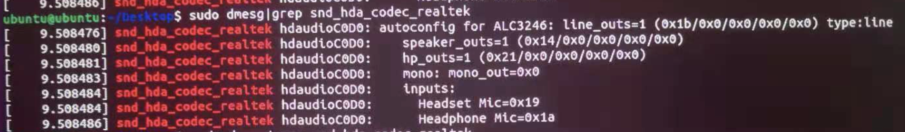
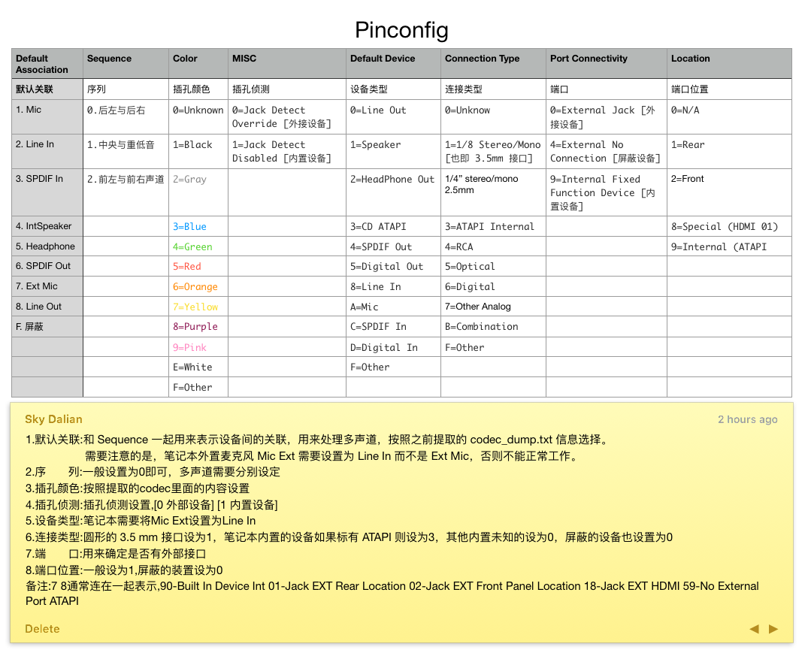

#codec_dump
```
./hda-tools/verbit.sh ubuntu20.1/card0/codec\#0 > codec_dump.txt
```
```
Verbs from Linux Codec Dump File: ../ubuntu20.1/card0/codec#0
Codec: Realtek ALC3246   Address: 0   DevID: 283902550 (0x10ec0256)
Jack   Color  Description                  Node     PinDefault             Original Verbs
--------------------------------------------------------------------------------------------------------  
Unknown Unknown  Line Out at Ext N/A         18 0x12   0x40000000   01271c00 01271d00 01271e00 01271f40  
1/8   Black  Speaker at Ext Rear         19 0x13   0x411111f0   01371cf0 01371d11 01371e11 01371f41  
Analog Unknown  Speaker at Int N/A          20 0x14   0x90170110   01471c10 01471d01 01471e17 01471f90  
1/8   Black  Speaker at Ext Rear         24 0x18   0x411111f0   01871cf0 01871d11 01871e11 01871f41  
1/8   Black  Speaker at Ext Rear         25 0x19   0x411111f0   01971cf0 01971d11 01971e11 01971f41  
1/8   Black  Speaker at Ext Rear         26 0x1a   0x411111f0   01a71cf0 01a71d11 01a71e11 01a71f41  
Line Out at Ext Rear    0x1b 0x1b                        16846880 01b71c20 01b71d10     01b71e01 01b71f01  
RCA UNKNOWN  SPDIF Out at Ext N/A        29 0x1d   0x4044c029   01d71c29 01d71dc0 01d71e44 01d71f40  
1/4   Black  Speaker at Ext Front        30 0x1e   0x421215f2   01e71cf2 01e71d15 01e71e12 01e71f42  
1/8   Black  HP Out at Ext Front         33 0x21   0x0221101f   02171c1f 02171d10 02171e21 02171f02  
--------------------------------------------------------------------------------------------------------
Jack   Color  Description                  Node     PinDefault             Modified Verbs
--------------------------------------------------------------------------------------------------------
Unknown Unknown  Line Out at Ext N/A         18 0x12   0x40000000   01271c00 01271d00 01271e00 01271f40
Analog Unknown  Speaker at Int N/A          20 0x14   0x90170110   01471c30 01471d00 01471e17 01471f90
Line Out at Ext Rear    0x1b 0x1b                        16846880 01b71c20 01b71d10     01b71e01 01b71f01  
RCA UNKNOWN  SPDIF Out at Ext N/A        29 0x1d   0x4044c029   01d71c40 01d71dc0 01d71e44 01d71f40
1/4   Black  Speaker at Ext Front        30 0x1e   0x421215f2   01e71cf0 01e71d10 01e71e12 01e71f41
1/8   Black  HP Out at Ext Front         33 0x21   0x0221101f   02171c50 02171d10 02171e21 02171f01
--------------------------------------------------------------------------------------------------------
Modified Verbs in One Line: 01271c00 01271d00 01271e00 01271f40 01471c30 01471d00 01471e17 01471f90 01b71c20 01b71d10 01b71e01 01b71f01 01d71c40 01d71dc0 01d71e44 01d71f40 01e71cf0 01e71d10 01e71e12 01e71f41 02171c50 02171d10 02171e21 02171f01
--------------------------------------------------------------------------------------------------------
```

#ubuntu autoConfig info
图1：  


#根据codecDump和图1的得到节点列表
0x1b节点修正  
根据Line Out at Ext Rear    0x1b 0x1b  16846880 01b71c20 01b71d10 01b71e01 01b71f01  
最后四组的位数得到 20 10 01 01 反转得到01 01 10 20  ==> 0x01011020

|十进制Node|Node|Description|ubuntu info|PinDefault|PinDefault反转(C D E F)
|---|---|---|---|---|---|
|18 |0x12 |Line Out at Ext N/A |             |0x40000000 |00 00 00 40         
|19 |0x13 |Speaker at Ext Rear |             |0x411111f0 |f0 11 11 41
|20 |0x14 |Speaker at Int N/A  |speaker_outs |0x90170110 |10 01 17 90
|24 |0x18 |Speaker at Ext Rear |             |0x411111f0 |f0 11 11 41
|25 |0x19 |Speaker at Ext Rear |Headset Mic  |0x411111f0 |f0 11 11 41
|26 |0x1a |Speaker at Ext Rear |Headphone Mic|0x411111f0 |f0 11 11 41
|27 |0x1b |Line Out at Ext Rear|line_outs    |0x01011020 |20 10 01 01  
|29 |0x1d |SPDIF Out at Ext N/A|             |0x4044c029 |29 c0 44 40
|30 |0x1e |Speaker at Ext Front|             |0x421215f2 |f2 15 12 42
|33 |0x21 |HP Out at Ext Front |hp_outs      |0x0221101f |1f 10 21 02

#codecgraph路径信息
图2:

同时注意:  
- 0x14 EAPD节点左侧是0x02
- 0x21 EAPD节点左侧是0x03
- 0x1b EAPD节点左侧是0x03

#根据codecGraph补充节点路径
|十进制Node|Node|Description|ubuntu info|PinDefault|PinDefault反转|16进制路径|10进制路径|
|---|---|---|---|---|---|---|---
|18 |0x12 |Line Out at Ext N/A  |             |0x40000000 |00 00 00 40 |                                   |
|19 |0x13 |Speaker at Ext Rear  |             |0x411111f0 |f0 11 11 41 |                                   |
|20 |0x14 |Speaker at Int N/A   |speaker_outs |0x90170110 |10 01 17 90 |0x14->0x02                         |20->2
|24 |0x18 |Speaker at Ext Rear  |             |0x411111f0 |f0 11 11 41 |                                   |
|25 |0x19 |Speaker at Ext Rear  |Headset Mic  |0x411111f0 |f0 11 11 41 |0x08->0x23->0x19 0x09->0x22->0x19  |8->35->25 9->34->25
|26 |0x1a |Speaker at Ext Rear  |Headphone Mic|0x411111f0 |f0 11 11 41 |0x08->0x23->0x1a 0x09->0x22->0x1a  |8->35->26 9->34->26
|27 |0x1b |Line Out at Ext Rear |line_outs    |0x01011020 |20 10 01 01 |0x1b->0x03                         |27->3
|29 |0x1d |SPDIF Out at Ext N/A |             |0x4044c029 |29 c0 44 40 |                                   |
|30 |0x1e |Speaker at Ext Front |             |0x421215f2 |f2 15 12 42 |                                   |
|33 |0x21 |HP Out at Ext Front  |hp_outs      |0x0221101f |1f 10 21 02 |0x21->0x03                         |33->3


#pinconfigs
图3:


#根据pinConfig图3修正数据
根据ubuntu info得知有些节点是有效的,有些节点是需要屏蔽的  
比如0x19是被屏蔽的,因此需要修正数据  
比如0x1d是无效节点,隐藏需要屏蔽  
根据图3中8个列可以知道f 0 0 0 0 0 4 0 可以屏蔽设备,即:f0 00 00 40  
Connection Type的连接类型中,正好有个B=Combination,它的意思就是:组合,我需要同时修正耳麦和耳机的数值:  
0x19 |Speaker at Ext Rear : f0 11 11 41->70 20 ab 02  
0x21 |HP Out at Ext Front : 30 10 21 02->30 10 2b 02  


|十进制Node|Node|Description|ubuntu info|PinDefault|PinDefault反转|PinDefault反转修正|16进制路径|10进制路径|
|---|---|---|---|---|---|---|---|---
|18 |0x12 |Line Out at Ext N/A  |             |0x40000000 |00 00 00 40 |f0 00 00 40|                                   |
|19 |0x13 |Speaker at Ext Rear  |             |0x411111f0 |f0 11 11 41 |f0 00 00 40|                                   |
|20 |0x14 |Speaker at Int N/A   |speaker_outs |0x90170110 |10 01 17 90 |40 01 17 90|0x14->0x02                         |20->2
|24 |0x18 |Speaker at Ext Rear  |             |0x411111f0 |f0 11 11 41 |f0 00 00 40|                                   |
|25 |0x19 |Speaker at Ext Rear  |Headset Mic  |0x411111f0 |f0 11 11 41 |70 20 ab 02|0x08->0x23->0x19 0x09->0x22->0x19  |8->35->25 9->34->25
|26 |0x1a |Speaker at Ext Rear  |Headphone Mic|0x411111f0 |f0 11 11 41 |f0 00 00 40|0x08->0x23->0x1a 0x09->0x22->0x1a  |8->35->26 9->34->26
|27 |0x1b |Line Out at Ext Rear |line_outs    |0x01011020 |20 10 01 01 |20 10 01 01|0x1b->0x03                         |27->3
|29 |0x1d |SPDIF Out at Ext N/A |             |0x4044c029 |29 c0 44 40 |f0 00 00 40|                                   |
|30 |0x1e |Speaker at Ext Front |             |0x421215f2 |f2 15 12 42 |f0 00 00 40|                                   |
|33 |0x21 |HP Out at Ext Front  |hp_outs      |0x0221101f |1f 10 21 02 |30 10 2b 02|0x21->0x03                         |33->3

#生成configData
ConfigData的计算公式为:
- Address + Node + 71c +【c】
- Address + Node + 71d +【d】
- Address + Node + 71e +【e】
- Address + Node + 71f +【f】  
    c d e f 是PinDefault反转的4组数值  
    我的ALC256的Address值为0,现在我将节点0x12的ConfigData值通过上面的公式整理后得出:  
    02171c30 02171d10 02171e2b 02171f02 02170c03  
    然后考虑到输出节点上只有0x21有EAPD，且值为0x3，则需要在节点有EAPD的后面加上Address+Node+70c+EAPD值  

|十进制Node|Node|Description|ubuntu info|PinDefault|PinDefault反转|PinDefault反转修正|configData|16进制路径|10进制路径|
|---|---|---|---|---|---|---|---|---|---
|18 |0x12 |Line Out at Ext N/A  |             |0x40000000 |00 00 00 40 |f0 00 00 40|01271cf0 01271d00 01271e00 01271f40         |                                   | 
|19 |0x13 |Speaker at Ext Rear  |             |0x411111f0 |f0 11 11 41 |f0 00 00 40|01371cf0 01371d00 01371e00 01371f40         |                                   |
|20 |0x14 |Speaker at Int N/A   |speaker_outs |0x90170110 |10 01 17 90 |40 01 17 90|01471c40 01471d01 01471e17 01471f90 01470c02|0x14->0x02                         |20->2
|24 |0x18 |Speaker at Ext Rear  |             |0x411111f0 |f0 11 11 41 |f0 00 00 40|01871cf0 01871d00 01871e00 01871f40         |                                   |
|25 |0x19 |Speaker at Ext Rear  |Headset Mic  |0x411111f0 |f0 11 11 41 |70 10 8b 02|01971c70 01971d10 01971e8b 01971f02         |0x08->0x23->0x19 0x09->0x22->0x19  |8->35->25 9->34->25
|26 |0x1a |Speaker at Ext Rear  |Headphone Mic|0x411111f0 |f0 11 11 41 |f0 00 00 40|01a71cf0 01a71d00 01a71e00 01a71f40         |0x08->0x23->0x1a 0x09->0x22->0x1a  |8->35->26 9->34->26
|27 |0x1b |Line Out at Ext Rear |line_outs    |0x01011020 |20 10 01 01 |80 10 01 02|01b71c80 01b71d10 01b71e01 01b71f02 01b70c03|0x1b->0x03                         |27->3
|29 |0x1d |SPDIF Out at Ext N/A |             |0x4044c029 |29 c0 44 40 |f0 00 00 40|01d71cf0 01d71d00 01d71e00 01d71f40         |                                   |
|30 |0x1e |Speaker at Ext Front |             |0x421215f2 |f2 15 12 42 |f0 00 00 40|01e71cf0 01e71d00 01e71e00 01e71f40         |                                   |
|33 |0x21 |HP Out at Ext Front  |hp_outs      |0x0221101f |1f 10 21 02 |50 10 2b 02|02171c50 02171d10 02171e2b 02171f02 02170c03|0x21->0x03                         |33->3

#67参考数据
```
01471C10 01471D01 01471E17 01471F90 01470C02    10 01 17 90  喇叭   20->2
01971C40 01971D10 01971E8B 01971F02             40 10 8b 02  耳麦   8->35->25
01B71C20 01B71D10 01B71E01 01B71F01 01B70C02    20 10 01 01  线路输出 27->3
02171C30 02171D10 02171E2B 02171F02 02170C02    30 10 2b 02  耳机  33->2
0: 
    0:8->35->25  耳麦
1: 
    0: 20->2  喇叭
    1: 33->2  耳机
2: 
    0: 27->3 线路输出
```
#成功数据A
卡顿
耳机耳麦切换成功,耳机喇叭线路输出切换成功
```
platforms 
0组: 70 10 8b 02 耳麦 8->35->25
1组: 
    0:  50 10 2b 02 耳机       33->3
    1:  80 10 01 02 线路输出    27->3
    2:  40 01 17 90 喇叭       20->2
```
#成功数据A2 
默认显示喇叭,线路输出插孔显示覆盖喇叭,耳机插孔触发切换覆盖喇叭,卡顿爆音
```
platforms 
0组: 70 10 8b 02 耳麦 8->35->25
1组: 
    0:  40 01 17 90 喇叭       20->2
    1:  50 10 2b 02 耳机       33->3
    2:  80 10 01 02 线路输出    27->3
```
#成功数据A3
爆音卡顿
耳机耳麦切换成功,耳机喇叭线路输出切换成功,线路输出单独一组
切换到耳机模式后,线路输出无声音
```
platforms 
0组: 70 10 8b 02 耳麦 8->35->25
1组: 
    0:  40 01 17 90 喇叭       20->2
    1:  50 10 2b 02 耳机       33->3
2组:
    0:  80 10 01 02 线路输出    27->3
```

#成功数据B
耳机耳麦切换成功,耳机喇叭切换成功 线路输出单独一组  
耳机耳麦切换后会导致线路输出不再成功
```
platforms 
0组: 70 10 8b 02 耳麦 8->35->25
1组: 
    0:  50 10 2b 02 耳机       33->3
    1:  40 01 17 90 喇叭       20->2
2组:
    0:  60 10 01 02 线路输出    27->3
```

- 最后得到ConfgiData:
```
01271cf0 01271d00 01271e00 01271f40
01371cf0 01371d00 01371e00 01371f40
01471c40 01471d01 01471e17 01471f90
01871cf0 01871d00 01871e00 01871f40
01971c70 01971d10 01971e8b 01971f02
01a71cf0 01a71d00 01a71e00 01a71f40
01b71c80 01b71d10 01b71e01 01b71f02
01d71cf0 01d71d00 01d71e00 01d71f40
01e71cf0 01e71d00 01e71e00 01e71f40
02171c50 02171d10 02171e2b 02171f02
01470c02 01b70c03 02170c03
```

# 根据路径和configData配置layout

耳机优先级一定要低于内置扬声器，外置麦克风一定要低于内置麦克风，默认开启的是内置扬声器和麦克风，第四组数据把耳机设置为0，既插入检测。这样就可以实现自动切换了。
#Platforms
PathMap下一共三大项：
- 0为输入(第一输入项，外置mic可以实现自动切换的只需要一个输入项，无法实现的需要第二输入项)  
  输入项分为三大项:  
  - 0为内置mic
  - 1为linein 
  - 2为外置mic(ALC892外置mic通过linein实现，由此删除外置mic项)
- 1为输出(第一输出项)  
  输出项分为三大项：  
  - 0为耳机
  - 1为内置扬声器
  - 2位lineout  
  以内置mic为例：内置mic底层三项代表三个节点，将之前推导的三个节点按顺序输入到NodeID中  
  在内置mic节点添加boost项(设置电平增效数值为1、2、3，数值3最大)，设置为3，可以减少mic杂音的情况(外置mic和linein的节点也可以添加boost项)
- 2为SPDIF

#layout
外置mic需要修改电压控制值来实现外置mic驱动。
搜索codec中外置mic下的vref值，vref含义为初始电压基础上增加的百分比，如图为vref为50。
当vref不为Hiz时，muteGPIO={(vref转换为16进制)+"0100"+node id}转换为10进制，
codec中vref表示的是十进制，计算时转为16进制。如：在节点 0x18发现vref_50，50转换为16进制=32，
则muteGPIO=(32010018)转换为10进制=838926360；如果vref为Hiz，则muteGPIO=0
vref值.png
由于外置mic需要通过linein实现，因此修改linein中的muteGPIO为838926360

根据一楼的介绍排列成如下形式
01271C⑦⑧ 01271D⑤⑥ 01271E③④ 01271F①②
01471C⑦⑧ 01471D⑤⑥ 01471E③④ 01471F①②
01871C⑦⑧ 01871D⑤⑥ 01871E③④ 01871F①②
01A71C⑦⑧ 01A71D⑤⑥ 01A71E③④ 01A71F①②
01B71C⑦⑧ 01B71D⑤⑥ 01B71E③④ 01B71F①②
01E71C⑦⑧ 01E71D⑤⑥ 01E71E③④ 01E71F①②
01470C02

codec内有EAPD字样的，必须在configdata最后加入一组01470C02


三。修改①-⑧的数值
⑦是接口的顺序。数字越低那么优先权就越高。每一个接口的顺序必须不一样。Codec_dump出来的有些接口顺序号码是一样，所以一定要改过来。如果有 [N/A] 的接口既是无用的接口可以设成 f。
如果你的声卡有line out 节点那么
Mic at Int N/A  =5
HP Out at Ext Rear =1
Mic at Ext Rear = 4
Line In at Ext Rear =4
Speaker at Int N/A          =1
SPDIF Out at Ext Rear   =3
line out=2
如果无line out则
Mic at Int N/A  =5
HP Out at Ext Rear =1
Mic at Ext Rear = 4
Line In at Ext Rear =4
Speaker at Int N/A          =2
SPDIF Out at Ext Rear   =3

对于⑧line out设置为f，其余皆为0
⑤为插口颜色
0 = Unknown
1 = Black
2 = Grey
3 = Blue
4 = Green
5 = Red
6 = Orange
7 = Yellow
8 = Purple
9 = Pink
A - D = Reserved
E = White
F = Other
这个没什么好说的，自己在codec中查找。


⑥：接口一般是 0，意思是之当接口被检测到就直接使用。如果是本本的话内建的麦克风和喇叭要设成1。理论是当我们把耳机插入本本机口的时候，内建喇叭会静音，耳机0 接口被检测到就是用耳机。
Mic at Int N/A  =1
HP Out at Ext Rear =0
Mic at Ext Rear = 0
Line In at Ext Rear =0
Speaker at Int N/A          =1
SPDIF Out at Ext Rear   =1
line out=0

③说明特定接口的功能是什么，对应以下设置就OK
0 = Line Out
1 = Speaker
2 = HP Out
3 = CD
4 = SPDIF Out
5 = Digital Other Out
6 = Modem Line Side
7 = Modem Handset Side
8 = Line In
9 = AUX
A = Mic In
B = Telephone
C = SPDIF In
D = Digital Other In
E = Reserved
F = Other

④是连接装置类型
0 = Unknown
1 = 1/8" stereo/mono
2 = 1/4' stereo/mono
3 = ATAPI internal
4 = RCA
5 = Optical
6 = Other Digital
7 = Other Analog
8 = Multichannel Analog (DIN)
9 = XLR/Professional
A = RJ-11 (Modem)
B = Combination
F = Other
通常接口是 1/8" stereo/mono，SPDIF 是 Optical。本本内建的接口是 ATAPI internal。

Mic at Int N/A  =3
HP Out at Ext Rear =1
Mic at Ext Rear = 1
Line In at Ext Rear =1
Speaker at Int N/A          =3
SPDIF Out at Ext Rear   =5
line out=1


对于①： 0就是插入接口的，就像麦克风、喇叭等。如果你dump出来有 [N/A] 的就是无用的port，这里的数字是4。
而9通常是给本本的，像内置喇叭、内置麦克风等Mic at Int N/A  =9
HP Out at Ext Rear =0
Mic at Ext Rear = 0
Line In at Ext Rear =0
Speaker at Int N/A          =9
SPDIF Out at Ext Rear   =0
line out=0


②表示插口所在位置
0 = Rear
1 = Front
8=HDMI
9=ATAPI
我的设置如下
Mic at Int N/A  =9
HP Out at Ext Rear =1
Mic at Ext Rear = 1
Line In at Ext Rear =1
Speaker at Int N/A          =9
SPDIF Out at Ext Rear   =0
line out=1